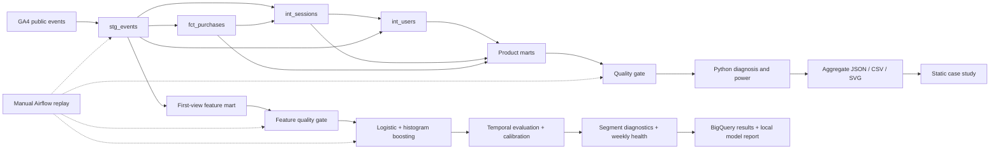
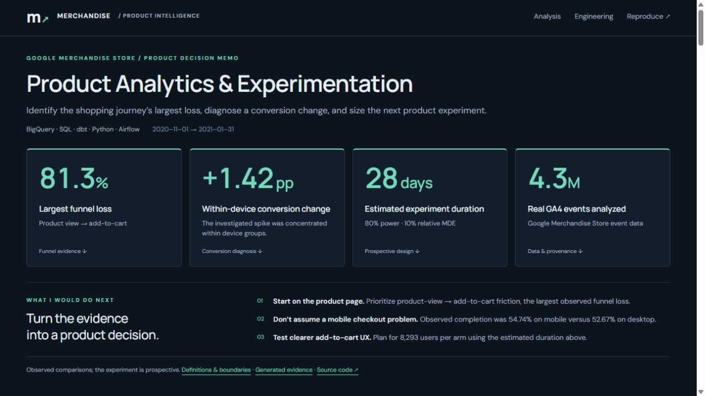

# Product Analytics & Experimentation Platform
### Google Merchandise Store · BigQuery / SQL / dbt / Airflow

**Business problem:** identify where ecommerce journeys lose users, distinguish audience changes from changes within segments, and design a defensible next product experiment.

**Execution status:** the full BigQuery pipeline has run against the real source, all warehouse quality gates passed, and the site publishes observed results. The prospective experiment has **not** been run.

<!-- BEGIN GENERATED FINDINGS -->

## Verified findings

* **Largest drop-off: product view to cart:** 14,380 of 77,020 eligible sessions progressed; 81.3% did not. End-to-end completion was 3.6%. **Decision:** Clarify availability and the add-to-cart action on product pages. Validate event order before testing. Descriptive sequence, not a causal effect.

* **Device checkout comparison:** Mobile 54.74%; desktop 52.67%. Difference +2.06 percentage points. **Decision:** Do not prioritize mobile checkout based on an assumed deficit; test the larger observed funnel bottleneck first. Exploratory association; multiple segment comparisons are not confirmatory tests.

* **A real conversion change on 2021-01-22:** Session conversion was 2.18%, versus 0.76% across prior matched weekdays. Device mix contributed -0.001 pp; within-device rates +1.417 pp. **Decision:** Review changes in traffic quality, product demand and instrumentation across devices. Do not attribute the change to a release without independent evidence. Descriptive decomposition; no product incident or causal explanation is established.

* **Return on the seventh day:** 1,966 of 250,712 eligible first-observed users returned on exact D7 (0.8%). **Decision:** Compare mature cohorts and first-session behavior before planning retention interventions. No claim that carting or purchasing causes return.

* **A testable next product decision:** The eligible-user baseline is 16.44%. A 10% relative MDE requires 8,293 users per arm at 80% power (~28 days), or 11,102 at 90% (~35 days). **Decision:** Clarify availability and the add-to-cart action on product pages. Randomize users with persistent assignment. Prospective design at two-sided 5% alpha and 50/50 allocation; no treatment result.

Generated from [report.json](data/published/report.json); source aggregates and query hashes are preserved alongside it.

<!-- END GENERATED FINDINGS -->

**[Case study](https://kohaningithub.github.io/google-merchandise-product-analytics/)** · [SQL](sql) · [Metric/data contracts](docs/data-dictionary.md) · [Experiment protocol](docs/experiment-design.md) · [Review & limitations](docs/review.md)

## Architecture



**Stack:** BigQuery Standard SQL; pandas; SciPy/statsmodels; real dbt project generated from canonical SQL; Airflow 3 TaskFlow DAG; pytest; Ruff; GitHub Actions; static HTML/CSS with progressive enhancement.



## Reproduce without BigQuery

Python 3.11+ (3.12 recommended for the optional dbt/Airflow ecosystem). From this directory:

```sh
python -m pip install -e ".[dev]"
python scripts/sync_dbt.py --check
python -m src.pipeline site
python -m pytest
python -m ruff check src tests scripts airflow
python -m http.server 8080 --directory site
```

Open `http://localhost:8080`. The committed report and aggregate query outputs render verified results without cloud credentials. Synthetic fixtures live only in tests and temporary test directories; they are not website inputs. Raw event/user/session rows are not downloaded.

## One-time BigQuery access

1. Create or select your own Google Cloud project, enable BigQuery, and use the [BigQuery sandbox](https://docs.cloud.google.com/bigquery/docs/sandbox) if you do not want billing. You need permission to create jobs and create/write the destination dataset. Access to a public dataset does not remove the requirement for a query project.
2. Install the [Google Cloud CLI](https://cloud.google.com/sdk/docs/install), then authenticate locally. Never add credentials to Git.

```powershell
# From the parent folder of your cloned repository:
cd google-merchandise-product-analytics
python -m pip install -e ".[dev]"
gcloud auth application-default login
$env:GOOGLE_CLOUD_PROJECT="project-a1c7b526-d5b8-4e0c-9f1"
$env:BQ_DATASET="product_analytics"
$env:BQ_LOCATION="US"
$env:BQ_MAX_BYTES="5000000000"
python -m src.pipeline all
```

On Bash use `export GOOGLE_CLOUD_PROJECT=YOUR_ACTUAL_PROJECT_ID` and the equivalent optional variables. `.env.example` documents configuration; the runner reads environment variables, not the file automatically. The [official ADC instructions](https://docs.cloud.google.com/bigquery/docs/authentication) describe local authentication.

The full command executes: **audit → models → validate → export → analyze → monitor → site**. Alternatively run each stage with `python -m src.pipeline STAGE`, or use `make audit`, `make models`, `make validate`, `make export`, `make analyze`, `make monitor`, `make site`, `make test`. Models require audit/staging first; analyze requires validated exports. Review audit warnings even when release-blocking tests pass.

### Cost controls

The raw scan always uses `_TABLE_SUFFIX BETWEEN '20201101' AND '20210131'` and only selects needed fields. Subsequent queries read materialized models, not the wildcard source. Every query gets a dry run and a default 5 GB per-query maximum; this is a limit, **not a measured scan estimate** and not a total budget. The driver records estimates, processed/billed bytes, cache status, job ID and SQL hash in `data/processed/query_log.jsonl`. Actual estimates and processed bytes for the latest successful queries are preserved in `report.json` under `warehouse_jobs`; SQL hashes and aggregate-input hashes are also preserved. Hashes normalize text to UTF-8 with LF line endings for cross-platform reproducibility. Inspect cumulative usage; free-tier sufficiency is not guaranteed for unlimited reruns. Sandbox tables expire, so rerun models when necessary. The driver sets a 60-day default expiry on its own destination dataset.

## Source and audit

Exact source: **`bigquery-public-data.ga4_obfuscated_sample_ecommerce.events_*`**, **2020-11-01 through 2021-01-31**. Google's [dataset documentation](https://developers.google.com/analytics/bigquery/web-ecommerce-demo-dataset) warns that the data is obfuscated, includes placeholders, and has limited internal consistency. It cannot be compared directly to the GA demo account.

`audit` records actual schema, date bounds, event names, user/session coverage, purchase and transaction issues, USD availability, device/country/acquisition values, repeated fingerprints, and required ecommerce event coverage. Missing IDs are visible exclusions. Known placeholders do not become valid user or transaction keys. Conflicting transaction IDs are quarantined before deduplication; the quality gate verifies that none entered the accepted fact table and reconciles the accepted subset. `transaction_diagnosis.json` retains the exclusion accounting.

## Analytical decisions worth inspecting

* **Funnel:** strict ordered timestamps at session grain; unordered user event reach is separate. Sample thresholds and Wilson intervals accompany device/country/source/proxy segments.
* **Retention:** exact D1/D7/D14/D30 return, per-user censoring, first-observed cohorts, and dimensions frozen before future activity. Cross-day first-session behavior is separately excluded.
* **Monitoring:** trailing 28 observations, at least 21 valid history values, 3.5 robust-score threshold, minimum rate denominators, no current/future baseline contamination. Zero MAD skips a flag; missing revenue suppresses revenue monitoring.
* **Diagnosis:** a real flag triggers matched-weekday comparison, device/country/source/proxy contributions, stage transitions, and symmetric mix/within-rate decomposition. Revenue additionally separates volume from revenue/session. Effects are descriptive and reconcile mathematically; they are not causal attributions.
* **Experiment:** select an observed bottleneck, align eligibility to one user per transition, and calculate prospective 80%/90% power scenarios. The MDE is a planning assumption, not a predicted outcome.

## dbt and Airflow

Canonical transformations live in `sql/`; `python scripts/sync_dbt.py` generates `dbt/models/` and singular tests. CI checks for drift. To use dbt instead of the direct materialization runner, install `.[dbt]`, set your environment, then run `dbt build --project-dir dbt --profiles-dir dbt`. Schema tests include unique/not-null keys and accepted retention horizons; singular SQL checks cover conflicts, chronology and reconciliation. This does not create Python exports; run the direct `validate`, `export`, `analyze`, `monitor`, `site` steps afterward. Run `audit` first to persist audit inputs.

Airflow DAG: `airflow/dags/product_analytics_pipeline.py`, targeting Airflow 3.x. Install this package in the scheduler/worker environment and copy the DAG into its DAG folder. Use a persistent shared project/output directory on a single-host setup; distributed workers need shared storage. This example intentionally does not pass local files through XCom or pretend a shared filesystem exists in a distributed deployment. `schedule=None`, bounded retries, `max_active_runs=1`, and manual historical replay are intentional. Runtime scheduler execution has not been claimed from a syntax check.

## Production Data Science Extension

The existing product analytics is preserved. A separate first-product-view
conversion workflow now adds BigQuery/dbt features, logistic regression and
histogram gradient boosting, chronological validation, sigmoid calibration,
segment diagnostics and weekly model health. The original Airflow DAG now accepts
date windows and an optional model branch; replay outputs use isolated datasets
and local directories with overwrite semantics.

**Verification boundary:** the modeling lifecycle and leakage/rerun contracts pass
local synthetic tests. Real GA4 model metrics and a Linux Airflow execution are
still pending credentials/runtime access on this desktop. The earlier verified
BigQuery analytics results above are not evidence of model execution. No model
scores are published until the real workflow runs.

Train: **November 2–December 14, 2020**. Validation: **December 15–31** (calibration
fit December 15–23; model selection December 24–31). Final test: **January 1–30,
2021**. No future events or user/session identifiers enter the feature matrix.

```powershell
python -m pip install -e ".[dev,ml]"
python -m src.replay estimate --start-date 2021-01-15 --end-date 2021-01-21
# After reviewing the scan estimate:
python -m src.replay all --start-date 2021-01-15 --end-date 2021-01-21
# Full-window training requires its own estimate first:
python -m src.replay estimate
python -m src.replay all --include-model
```

[Prediction/leakage contract](docs/model-contract.md) ·
[Operations, replay and runtime verification](docs/model-operations.md) ·
[Initial audit](docs/ds-audit.md) · [Current execution evidence](docs/execution-evidence.md).

## Existing analytics tests and publication

Tests cover censoring boundaries, zero denominators, power monotonicity, past-only detection, incomplete revenue, exact decomposition including entering/exiting segments, canonical dbt drift, BigQuery parsing, site provenance contracts, and DAG syntax. This run passed the warehouse quality gate and all dbt tests against the real BigQuery tables. The dated [dbt validation output](data/published/dbt-validation.json) records those results; Python tests also reconstruct the committed analytical artifacts.

The repository workflows test this project and publish only this case study to GitHub Pages. The original private portfolio repository remains private. Site values render from `data/published/report.json`; the JSON and aggregate CSVs are downloadable. Figures are generated from those same records. Analytical figures are absent when data is absent.

The completed run preserves schema, audit, quality and aggregate inputs under `data/published/inputs/`, plus generated findings, prospective power design, historical alerts, diagnosis and charts. Tests reconstruct the published findings, experiment baseline, contribution analysis, CSVs and SVGs from those input snapshots. The January investigation includes a two-recent-Friday sensitivity comparison because the longer matched-weekday baseline includes holidays.

## Authentication used for this execution

The CLI was signed in but the conventional ADC file was absent. The run used the existing CLI-generated credential file through `GOOGLE_APPLICATION_CREDENTIALS`; no credentials were copied or committed. To reuse the same local sign-in in PowerShell:

```powershell
$gcloud = Join-Path $env:LOCALAPPDATA 'Google\Cloud SDK\google-cloud-sdk\bin\gcloud.cmd'
$account = (& $gcloud auth list --filter=status:ACTIVE --format='value(account)').Trim()
$env:GOOGLE_APPLICATION_CREDENTIALS = Join-Path $env:APPDATA "gcloud\legacy_credentials\$account\adc.json"
$env:GOOGLE_CLOUD_PROJECT = 'project-a1c7b526-d5b8-4e0c-9f1'
python -m src.pipeline all
python -m pytest -q
python -m ruff check src tests scripts airflow
```

Other users should authenticate with their own project and the standard ADC command above. A local BigQuery run generates results; commit the refreshed published aggregates and site files to `main` to trigger Pages deployment.
