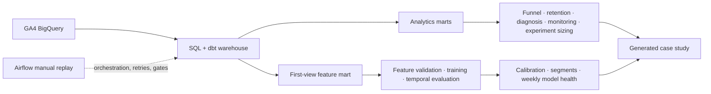

# Product Analytics & Data Science on GA4

A production-oriented case study using the Google Merchandise Store public GA4 export to diagnose product behavior, design an experiment, model session conversion, evaluate calibration and model health, and replay the workflow through Airflow.

**Stack:** BigQuery · SQL · dbt · Python · scikit-learn · Airflow

**Verified execution:** 4.30M staged events, 360,129 sessions, 75,414 model-feature rows, and a successful 16-task Airflow 3.1.7 run. The product experiment is a prospective design; no treatment result is claimed.

**[View the case study](https://kohaningithub.github.io/google-merchandise-product-analytics/)** · [Execution evidence](docs/execution-evidence.md) · [Metric contracts](docs/data-dictionary.md) · [Model contract](docs/model-contract.md)

<!-- BEGIN GENERATED FINDINGS -->

## Verified findings

* **Largest drop-off: product view to cart:** 14,380 of 77,020 eligible sessions progressed; 81.3% did not. End-to-end completion was 3.6%. **Decision:** Clarify availability and the add-to-cart action on product pages. Validate event order before testing. Descriptive sequence, not a causal effect.

* **Device checkout comparison:** Mobile 54.74%; desktop 52.67%. Difference +2.06 percentage points. **Decision:** Do not prioritize mobile checkout based on an assumed deficit; test the larger observed funnel bottleneck first. Exploratory association; multiple segment comparisons are not confirmatory tests.

* **A real conversion change on 2021-01-22:** Session conversion was 2.18%, versus 0.76% across prior matched weekdays. Device mix contributed -0.001 pp; within-device rates +1.417 pp. **Decision:** Review changes in traffic quality, product demand and instrumentation across devices. Do not attribute the change to a release without independent evidence. Descriptive decomposition; no product incident or causal explanation is established.

* **Return on the seventh day:** 1,966 of 250,712 eligible first-observed users returned on exact D7 (0.8%). **Decision:** Compare mature cohorts and first-session behavior before planning retention interventions. No claim that carting or purchasing causes return.

* **A testable next product decision:** The eligible-user baseline is 16.44%. A 10% relative MDE requires 8,293 users per arm at 80% power (~28 days), or 11,102 at 90% (~35 days). **Decision:** Clarify availability and the add-to-cart action on product pages. Randomize users with persistent assignment. Prospective design at two-sided 5% alpha and 50/50 allocation; no treatment result.

Generated from [report.json](data/published/report.json); source aggregates and query hashes are preserved alongside it.

<!-- END GENERATED FINDINGS -->

## Architecture



Transformations have explicit grains from events to sessions, users, accepted transactions, analytics marts, and the model feature mart. Airflow coordinates the existing SQL and Python tasks; it does not contain the training logic.

## Product analytics

The analytics layer answers where the journey loses users, whether major segments differ, whether a historical conversion change is meaningful, and whether that change reflects traffic mix or behavior within segments.

- **Funnel:** strict ordered timestamps at session grain; unordered event reach is separate.
- **Retention:** exact D1/D7/D14/D30 return with per-horizon right censoring and frozen initial attributes.
- **Diagnosis:** matched-weekday comparison and symmetric mix/within-rate decomposition. Results are observational.
- **Monitoring:** trailing robust baselines exclude the current day and open an investigation rather than assert an incident.
- **Experiment:** the measured product-view → cart baseline sizes a user-randomized prospective test.

## Modeling question and prediction contract

**Question:** using information available at the first product view, estimate the probability that the session eventually converts.

Features cover device and acquisition context, visitor state, temporal context, early engagement, and early product interaction. Purchase outcomes, events after the first product view, and raw identifiers cannot enter the estimator. See the [prediction and leakage contract](docs/model-contract.md).

## Temporal validation

| Window | Dates | Sessions | Conversion |
|---|---|---:|---:|
| Train | 2020-11-02 → 2020-12-14 | 40,993 | 6.7938% |
| Calibration | 2020-12-15 → 2020-12-23 | 8,406 | 6.9117% |
| Selection | 2020-12-24 → 2020-12-31 | 3,607 | 4.5744% |
| Final test | 2021-01-01 → 2021-01-30 | 22,408 | 4.6100% |

The predefined selection-window log-loss rule selected uncalibrated histogram gradient boosting. The final test remained untouched until selection was complete.

## Final-test model results

| Model | ROC-AUC | PR-AUC | Log loss | Brier | ECE | Decile lift |
|---|---:|---:|---:|---:|---:|---:|
| Logistic regression | 0.732620 | 0.112063 | 0.172704 | 0.042605 | 0.010828 | 2.8265× |
| Histogram boosting — selected | 0.750267 | 0.117913 | 0.172800 | 0.043137 | 0.020539 | 2.8458× |
| Boosting + sigmoid | 0.750267 | 0.117913 | 0.172851 | 0.042962 | 0.020668 | 2.8458× |

Boosting ranks sessions better, while logistic regression is better calibrated on the later test period by Brier score and ECE. This tradeoff is why the project reports discrimination, probability quality, segment behavior, and stability together. Metrics are preserved in [model_metrics.json](data/published/model/model_metrics.json).

## Calibration and model health

The selected boosting model overpredicts in the later period: its lowest equal-frequency bucket averages 0.65% predicted versus 0.31% observed, while the highest averages 20.54% predicted versus 13.12% observed. This is evidence of temporal calibration degradation requiring monitoring, not a model failure.

Five weekly windows show PR-AUC from 0.063049 to 0.153723, Brier from 0.034689 to 0.048028, and ECE from 0.011521 to 0.036210. Categorical unseen rates are zero. The large initial partial-week day-of-week PSI is not treated as an incident; later distribution changes are recorded for investigation.

Supported device and visitor-proxy results remain descriptive and predictive. They are not causal treatment effects.

## Airflow orchestration and real execution

Airflow 3.1.7 loaded `product_analytics_pipeline` with 16 tasks, typed `start_date`, `end_date`, and `include_model` parameters, two retries, a two-minute retry delay, validation gates, and final publication dependencies.

Two real 2021-01-15 → 2021-01-21 replays succeeded with the model branch disabled. The second produced identical row counts and full-table fingerprints. The full 2020-11-01 → 2021-01-31 model DAG completed all 16 tasks successfully in 153.317 seconds.

Every BigQuery statement was dry-run before execution and capped at 5 GiB per query. Detailed task states, fingerprints, query usage, and validation results are in [execution-evidence.md](docs/execution-evidence.md).

## Reproduce

### Local analytics and published artifacts

```sh
python -m pip install -e ".[dev,ml]"
python scripts/sync_dbt.py --check
python -m src.pipeline site
python -m pytest -q
python -m ruff check src tests scripts airflow
python -m http.server 8080 --directory site
```

Open `http://localhost:8080`. Committed aggregate and model artifacts render without cloud credentials. Synthetic fixtures are confined to tests.

### Bounded real BigQuery replay

```powershell
gcloud auth application-default login
$env:GOOGLE_CLOUD_PROJECT="your-project-id"
$env:BQ_DATASET="product_analytics"
$env:BQ_LOCATION="US"
$env:BQ_MAX_BYTES="5368709120"
python -m src.replay estimate --start-date 2021-01-15 --end-date 2021-01-21
python -m src.replay all --start-date 2021-01-15 --end-date 2021-01-21
```

Review the dry-run estimate before the bounded replay. Estimate the full window separately before running `python -m src.replay all --include-model`.

### Airflow on WSL/Linux

Create an isolated Python 3.12 environment, install the Airflow 3.1.7 constraints and this package, set `AIRFLOW_HOME`, `GOOGLE_APPLICATION_CREDENTIALS`, `GOOGLE_CLOUD_PROJECT`, and `BQ_MAX_BYTES`, then run:

```sh
python scripts/verify_airflow.py
python scripts/verify_airflow.py --execute --start-date 2021-01-15 --end-date 2021-01-21
```

Operational details are in [model-operations.md](docs/model-operations.md).

## Limitations

- The public GA4 export is finite, historical, obfuscated, and internally imperfect.
- There is no live traffic, production model serving, or automatic retraining deployment.
- Repeat-user and session observations are not fully independent.
- Feature availability is constrained by the first-view prediction contract.
- The selected model shows calibration drift in the final period.
- Pseudonymous browser IDs do not establish durable people-level or cross-device identity.
- Predictive and segment relationships are observational; the proposed experiment has no treatment result.

Raw event, user, and session rows are not downloaded or published. Generated JSON, CSV, SVG, and report files preserve the public-facing evidence trail.
