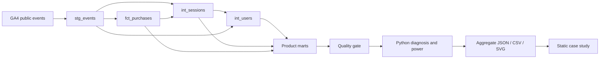

# Product Analytics & Experimentation Platform
### Google Merchandise Store · BigQuery / SQL / dbt / Airflow

**Business problem:** identify where ecommerce journeys lose users, distinguish audience changes from changes within segments, and design a defensible next product experiment.

**Current findings:** not yet available. The real public source is documented, but BigQuery application-default credentials and a query project are missing in this environment. No numerical business findings, incidents, experiment results, or synthetic headline data have been substituted. The full pipeline is implemented; live execution remains a required verification step.

**[Case study](https://kohaningithub.github.io/google-merchandise-product-analytics/)** · [SQL](sql) · [Metric/data contracts](docs/data-dictionary.md) · [Experiment protocol](docs/experiment-design.md) · [Review & limitations](docs/review.md)

## Architecture



**Stack:** BigQuery Standard SQL; pandas; SciPy/statsmodels; real dbt project generated from canonical SQL; Airflow 3 TaskFlow DAG; pytest; Ruff; GitHub Actions; static HTML/CSS with progressive enhancement.


## Reproduce without BigQuery

Python 3.11+ (3.12 recommended for the optional dbt/Airflow ecosystem). From this directory:

```sh
python -m pip install -e ".[dev]"
python scripts/sync_dbt.py --check
python -m src.pipeline site
python -m pytest
python -m ruff check src tests scripts airflow
python -m http.server 8080 --directory site
```

Open `http://localhost:8080`. The committed report renders the explicit pending-data state until a real run replaces it. Synthetic fixtures live only in tests; they are not website inputs. Once executed, small published aggregate snapshots can be committed for offline rendering. Raw event/user/session exports are not downloaded.

## One-time BigQuery access

1. Create or select your own Google Cloud project, enable BigQuery, and use the [BigQuery sandbox](https://docs.cloud.google.com/bigquery/docs/sandbox) if you do not want billing. You need permission to create jobs and create/write the destination dataset. Access to a public dataset does not remove the requirement for a query project.
2. Install the [Google Cloud CLI](https://cloud.google.com/sdk/docs/install), then authenticate locally. Never add credentials to Git.

```powershell
# From the parent folder of your cloned repository:
cd google-merchandise-product-analytics
python -m pip install -e ".[dev]"
gcloud auth application-default login
$env:GOOGLE_CLOUD_PROJECT="YOUR_ACTUAL_PROJECT_ID"
$env:BQ_DATASET="product_analytics"
$env:BQ_LOCATION="US"
$env:BQ_MAX_BYTES="5000000000"
python -m src.pipeline all
```

On Bash use `export GOOGLE_CLOUD_PROJECT=YOUR_ACTUAL_PROJECT_ID` and the equivalent optional variables. `.env.example` documents configuration; the runner reads environment variables, not the file automatically. The [official ADC instructions](https://docs.cloud.google.com/bigquery/docs/authentication) describe local authentication.

The full command executes: **audit → models → validate → export → analyze → monitor → site**. Alternatively run each stage with `python -m src.pipeline STAGE`, or use `make audit`, `make models`, `make validate`, `make export`, `make analyze`, `make monitor`, `make site`, `make test`. Models require audit/staging first; analyze requires validated exports. Review audit warnings even when release-blocking tests pass.

### Cost controls

The raw scan always uses `_TABLE_SUFFIX BETWEEN '20201101' AND '20210131'` and only selects needed fields. Subsequent queries read materialized models, not the wildcard source. Every query gets a dry run and a default 5 GB per-query maximum; this is a limit, **not a measured scan estimate** and not a total budget. The driver records estimates, processed/billed bytes, cache status, job ID and SQL hash in `data/processed/query_log.jsonl`. Actual bytes are unavailable until authenticated execution. Inspect cumulative usage; free-tier sufficiency is not guaranteed for unlimited reruns. Sandbox tables expire, so rerun models when necessary. The driver sets a 60-day default expiry on its own destination dataset.

## Source and audit

Exact source: **`bigquery-public-data.ga4_obfuscated_sample_ecommerce.events_*`**, **2020-11-01 through 2021-01-31**. Google's [dataset documentation](https://developers.google.com/analytics/bigquery/web-ecommerce-demo-dataset) warns that the data is obfuscated, includes placeholders, and has limited internal consistency. It cannot be compared directly to the GA demo account.

`audit` records actual schema, date bounds, event names, user/session coverage, purchase and transaction issues, USD availability, device/country/acquisition values, repeated fingerprints, and required ecommerce event coverage. Missing IDs are visible exclusions. Known placeholders do not become valid user or transaction keys.

## Analytical decisions worth inspecting

* **Funnel:** strict ordered timestamps at session grain; unordered user event reach is separate. Sample thresholds and Wilson intervals accompany device/country/source/proxy segments.
* **Retention:** exact D1/D7/D14/D30 return, per-user censoring, first-observed cohorts, and dimensions frozen before future activity. Cross-day first-session behavior is separately excluded.
* **Monitoring:** trailing 28 observations, at least 21 valid history values, 3.5 robust-score threshold, minimum rate denominators, no current/future baseline contamination. Zero MAD skips a flag; missing revenue suppresses revenue monitoring.
* **Diagnosis:** a real flag triggers matched-weekday comparison, device/country/source/proxy contributions, stage transitions, and symmetric mix/within-rate decomposition. Revenue additionally separates volume from revenue/session. Effects are descriptive and reconcile mathematically; they are not causal attributions.
* **Experiment:** select an observed bottleneck, align eligibility to one user per transition, and calculate prospective 80%/90% power scenarios. The MDE is a planning assumption, not a predicted outcome.

## dbt and Airflow

Canonical transformations live in `sql/`; `python scripts/sync_dbt.py` generates `dbt/models/` and singular tests. CI checks for drift. To use dbt instead of the direct materialization runner, install `.[dbt]`, set your environment, then run `dbt build --project-dir dbt --profiles-dir dbt`. Schema tests include unique/not-null keys and accepted retention horizons; singular SQL checks cover conflicts, chronology and reconciliation. This does not create Python exports; run the direct `validate`, `export`, `analyze`, `monitor`, `site` steps afterward. Run `audit` first to persist audit inputs.

Airflow DAG: `airflow/dags/product_analytics_pipeline.py`, targeting Airflow 3.x. Install this package in the scheduler/worker environment and copy the DAG into its DAG folder. Use a persistent shared project/output directory on a single-host setup; distributed workers need shared storage. This example intentionally does not pass local files through XCom or pretend a shared filesystem exists in a distributed deployment. `schedule=None`, bounded retries, `max_active_runs=1`, and manual historical replay are intentional. Runtime scheduler execution has not been claimed from a syntax check.

## Tests and publication

Tests cover censoring boundaries, zero denominators, power monotonicity, past-only detection, incomplete revenue, exact decomposition including entering/exiting segments, canonical dbt drift, BigQuery parsing, site provenance contracts, and DAG syntax. Offline tests do not replace a BigQuery execution or dbt adapter integration test.

The repository workflows test this project and publish only this case study to GitHub Pages. The original private portfolio repository remains private. Site values render from `data/published/report.json`; the JSON and aggregate CSVs are downloadable. Figures are generated from those same records. Analytical figures are absent when data is absent.

The first real run writes local schema/audit/quality/aggregate inputs, generated findings and power design, historical alerts, decomposition outputs, and chart artifacts. Inspect the quality results and limitations before committing refreshed aggregate outputs.
